# 13 Cool Tricks For HTML

<h2>Trick # 1 : TABLEIZER</h2>

* First select Excel spreadsheet 
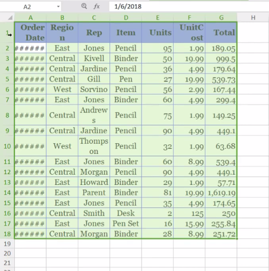

* And past in this site, then see the result:
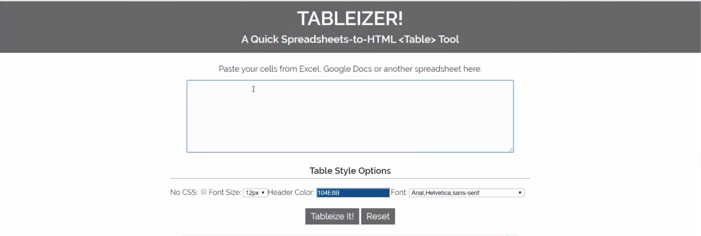
 https://tableizer.journalistopia.com/

<h2>Trick # 2 : COLOR PICKER</h2>

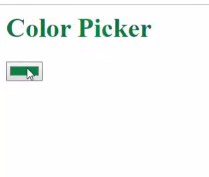

```
  <h3 id="Myelement" onclick="changeColor()">Color Picker</h3>
    
    <input name="MyColorPicker" type="color" id="ColorPicker1">
<script>
   function changeColor() {
           document.getElementByld("Myelement").style.color=document.getElementByld("ColorPicker1").value;
}
</script>
```

<h2>Trick # 3 : MetaData</h2>

MetaData tags are used in HTML documents to provide structured metedata about a web page

```
<meta name=”description” content=”Used auto parts for sale”>

<meta name=”keywords” content=”fuel filters, brake discs, belts”/>

```

<h2>Trick # 4 : HORIZONTAL LINE</h2>

A horizontal line to break up long sections of your website will make the page easier on the eye. To add the line, use the ```<hr/> tag```, as in:

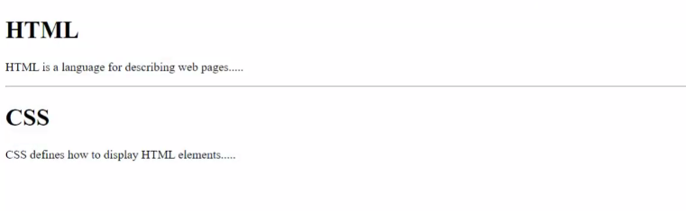

```
<h1>HTML</h1>
<p>HMTL is a language for describing web pages...</p>

<hr/>

<h1>CSS</h1>
<p> CSS define how to display HTML elements...</p>
```

<h2>Trick # 5 : HIGHLIGHT TEXT</h2> 

The ```<span> tag``` will let you add highlights to text on both Firefox and IE. You can choose the color of the highlight, of course. The code is simple:

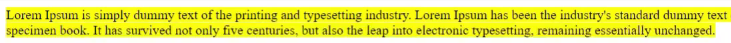

```
<span style=“ background-color: #FFFF00”>Your text here.</span>
```

<h2>Trick # 6 :Add background image to text</h2>
           
You can add a background image instead of a highlight to your text if the font is large enough.
The code is:

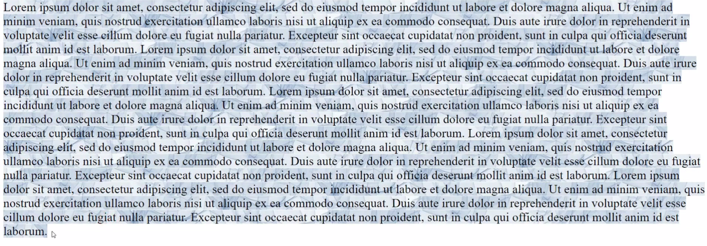

```
<SPAN STYLE=”background-image: url(//www.myimage.png ); font-size: 20pt”>NoBoringHighlight…</SPAN>
```

<h2>Trick # 7 : Map images</h2>

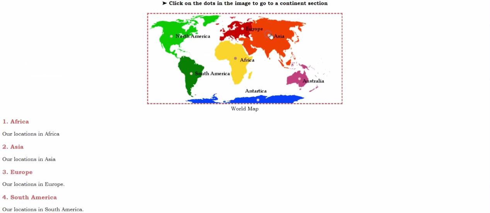


```
<h3 style="text-align:center;">The 7 Continents</h3>

<h4 style="text-align:center;">&#10148; Click on the dots in the image to go to a continent section</h4>

<map name="continents_map">

 <area shape="circle" coords="70,70,10" href="#north_america">

 <area shape="circle" coords="133,185,10" href="#south_america">

 <area shape="circle" coords="270,137,10" href="#africa">

 <area shape="circle" coords="292,44,10" href="#europe">

 <area shape="circle" coords="469,201,10" href="#australia">

 <area shape="circle" coords="374,65,10" href="#asia">

 <area shape="circle" coords="340,267,10" href="#antartica">

</map>

<figure style="text-align:center;">

    

    <figcaption>World Map</figcaption>

</figure>

<div>

    <h3 id="africa">Africa</h3>

    <p>Our locations in Africa</p>

</div>

<div>

    <h3 id="asia">Asia</h3>

    <p>Our locations in Asia</p>

</div>

<div>

    <h3 id="europe">Europe</h3>

    <p>Our locations in Europe.</p>

</div>

<div>

    <h3 id="south_america">South America</h3>

    <p>Our locations in South America.</p>

</div>

<div>

    <h3 id="north_america">North America</h3>

    <p>Our locations in North America:</p>

</div>

<div>

    <h3 id="antartica">Antarctica</h3>

    <p>Our locations in Antarctica.</p>

</div>

<div>

    <h3 id="australia">Australia</h3>

    <p>Our locations in Australia.</p>

</div>
The accompanying CSS code can be:

body {
    font-family: "bookman old style";
}
:target {
    color: lightyellow;
    background: indianred;
}
h3,
h1 {
    color: indianred;
}
img {
    border: 3px dashed indianred;
}
body {
    counter-reset: srl;
}
h3::before {
    counter-increment: srl;
    content: counter(srl)". ";
}
```

<h2>Trick # 8 :  FINE PRINT</h2>

Add legal rights, citations, restrictions, terms and other fine print at the bottom of your document with the ```<small> tag```.

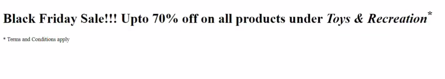


```
<h4>Black Friday Sale!!! Upto 70% off on all products under <i>Toys &amp; Recreation</i><sup>*</sup></h4>
<p><small>* Terms and Conditions apply</small></p>

```

<h2>Trick # 9 :  ADD MP3 PLAYER </h2>

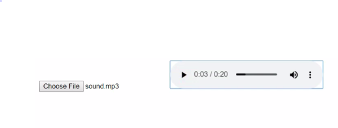

```
<input type="file" accept="audio/*" capture id="recorder">
<audio id=" player" controls></audio>
<script>
    const recorder =document.getElementByid('recorder');
  const player =document.getElementByid('player');
recrder.addEventListener('change',function(e) {
         const file = e.target.files[0];
          const url = URL.createObjectURL(file);
           player.src = url; });
</script>
```

<h2>Trick # 10: Allow visitors to change background or text color</h2>

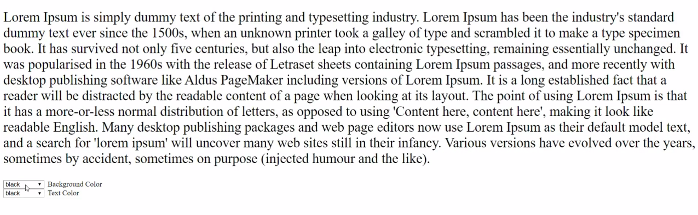

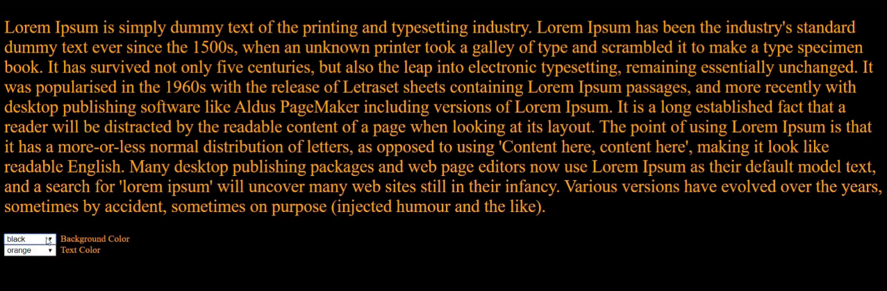

Here's the code you will need:
```
<select name=”clr” onchange=”document.bgColor=this.options[this.selectedIndex].value” size=”1″>
    <br>
    <option value=”black”>black
        <option value=”orange”>orange
            <option value=”flamingred”>fuschia
                <option value=”lightyellow”>light yellow
                    <option value=”green”>green
                        <option value=”cyan”>cyan
                            <option value=”yellow”>yellow
                                <option value=”red”>red
                                    <option value=”white”>white</option>
</select>&nbsp;&nbsp;Background Color

<br>
<select name=”clr” onchange=”document.fgColor=this.options[this.selectedIndex].value” size=”1″>
    <br>
    <option value=”black”>black
        <option value=”orange”>orange
            <option value=”flamingred”>fuschia
                <option value=”lightyellow”>light yellow
                    <option value=”cyan”>cyan
                        <option value=”yellow”>yellow
                            <option value=”red”>red
                                <option value=”white”>white</option>
</select>&nbsp;&nbsp;Text Color
```

<h2>Trick # 11 : INPUT SUGGESTIONS</h2>
 
 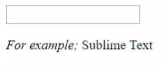
  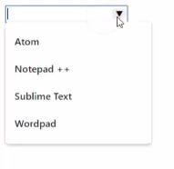
 
Type your favourite text editor:
```
<input type="text" list="text_editors">
<datalist id="text_editors">
    <option value="Atom"></option>
    <option value="Notepad ++"></option>
    <option value="Sublime Text"></option>
    <option value="Wordpad"></option>
</datalist>
<p><em>For example;
   </em> Sublime Text</p>
```

<h2>Trick # 12 : HIDE FIELD</h2>

  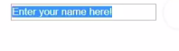

Here's how it works:

```
    <form name="contact" action="http://www.mydomain.com/myformhandler.cgi" method="POST">

        <div align="center">

            <input type="text" size="25" value="Enter your name here!">

            <input type="hidden" name="Language" value="English">

            <br><br>

        </div>

    </form>
```

<h2>Trick # 13 : Insert math equations</h2>

  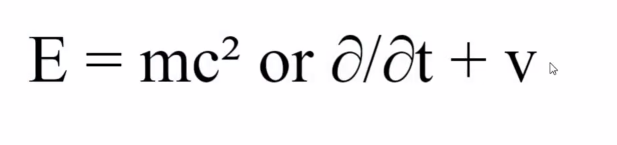

This code will insert a fraction 'a/b' to your page:
```
<math>

<mfrac>

<mi>a</mi>

<mi>b</mi>

</mfrac>

</math>
```
